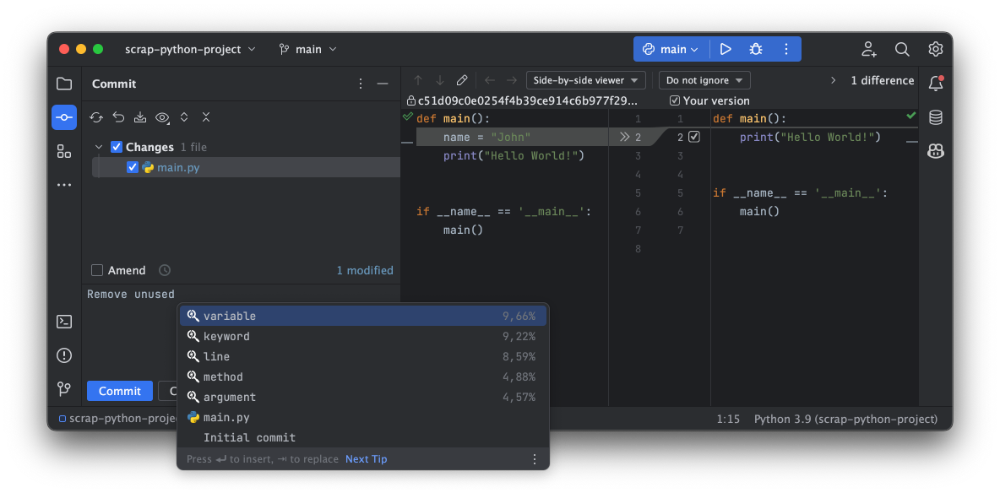

 

  

### Parrot - AI Autocomplete for Commit Messages
➡️ [Get it on Jetbrains Marketplace](https://plugins.jetbrains.com/plugin/20738-parrot--ai-commit-message-autocomplete)

Welcome to Parrot, the AI autocomplete plugin for commit messages! With Parrot, you can save time and improve the quality of your commit messages by using machine learning to generate suggestions for what to include in your message.

### 🔌 Plugins for IDEs
+ [Parrot for IntellJ](https://github.com/mamiksik/parrot-intellij)
+ [Parrot for VSCode](https://github.com/mamiksik/parrot-vscode)

### 🦾 Trained Models
+ [Parrot commit generation Model](https://huggingface.co/mamiksik/CommitPredictorT5PL)
+ [Parrot autocomplete model](https://huggingface.co/mamiksik/CodeBERTa-commit-message-autocomplete)

### 📚 Others
- [Parrot Dataset](https://huggingface.co/datasets/mamiksik/processed-commit-diffs)
- [Parrot Inference Server](https://github.com/mamiksik/ParrotInferenceServer)

### Usage
To use Parrot, simply start typing your commit message as usual. When you want to get a suggestion for the next word, use the autocomplete shortcut (typically Ctrl + Space or Cmd + Space). Parrot will then generate a list of suggestions based on the words you have already typed. You can select the suggestion you want to use and it will be automatically inserted into your message.

### Configuration
By default, the **source code patch is sent to [Hugging Face API](https://huggingface.co/mamiksik/CommitPredictor)** for completion. For that you have to generate your [own access token](https://huggingface.co/docs/hub/security-tokens) and configure it in the plugin settings.

Alternatively you can run the completion server locally. To do that, you have to install the [Parrot Inference Server](https://github.com/mamiksik/ParrotInferenceServer) and run it in background.

